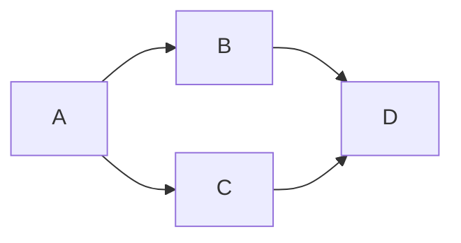

## Brainfxxk IDE v1.0

by frostwing98@github.com

欢迎report bug，或者加入开发

---

### 说明

这个本来是我的一个作业，现在发现挺有用的。

$$ \forall node \in BinaryTree,node.left<node<node.right$$

原来最初的版本是分布式的，有一个server和一个客户端，使用rmi部署，后来太麻烦，于是就去掉了注册的功能，就把这个仓促的整合了一下就上了，有什么bug欢迎发issues，我会进行修改。

目前比较稳定的功能是执行代码，之后会把代码按照工程化的标准重构。

---

#### features：

1. 执行ook/bf代码
2. 保存读取文件（修复中）
3. 有限的撤销操作（欢迎一起修改）
4. 随机bug

最后，祝大家在ctf坑里面都能做出点了不起的东西。

祝好。

$$©frostwing98 $$ of NJU Supernova Team

please contact:

 frostwing98@github.com

498924217@qq.com

frostwing98@gmail.com

